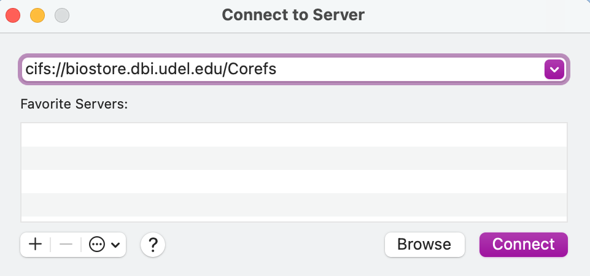
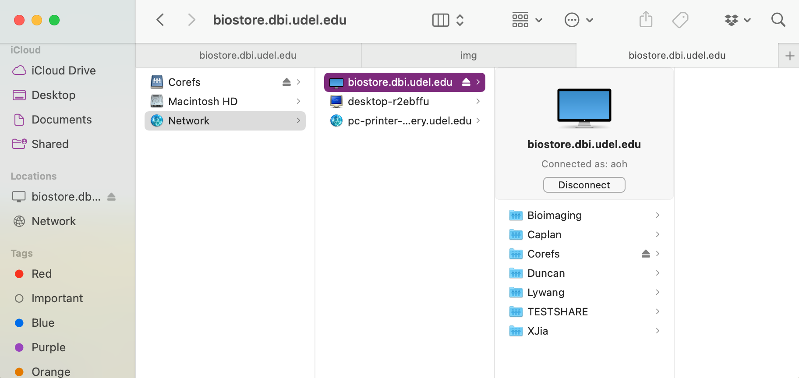

# Connecting to BioStore from MacOS

You will be using a file sharing protocol called CIFS (Common Internet File System) to connect to Biomix from your Mac.  Before you try to connect, make sure that you have completed the steps on the ["Getting Started"](./getting_started.md) page and are connected to UD's network.  If you are not on campus, this means that you must connect using the [VPN]((https://udeploy.udel.edu/software/anyconnect-vpn/).

1\. Click on the Finder.

2\. Drop down the Go menu and select the option "Connect to Server."  A dialogue box of the same name should appear.

3\. In the dropdown box at the top, enter `cifs://zee.dbi.udel.edu/` and hit "Connect."

4\. Another dialogue box will appear and ask you which volumes you want to mount.  Here, you should select the name of your group (most commonly, the last name of the PI) then hit "OK".  You will only have access to groups that you are a part of.

As an alternative, you can compress steps 3 and 4 into a single step by including the name of the volume in the server entry box, as below:

5\. Finally, enter your username and password into the new dialogue box that appears.  Make sure that the option "Registered User" is selected, and then enter your username and password.  Your username will be `name@ZEEISILON`, where `name` is the beginning of your udel email (the part before @udel.edu).  Your password should have been set up in previous steps.  After entering your username and password, hit "Connect."  A progress bar will appear.

6\. You will now be connected to BioStore!  A new Finder window or tab should be opened automatically and display some of the directories on BioStore.  You will only be able to access directories where you have permissions and others will appear empty.  If your view mode is set to "as Columns" your view should look something like this:

You will now be able to use BioStore from either your file browser window or the command line.  When you are done using BioStore, you can disconnect from the server using the "Disconnect" button.  